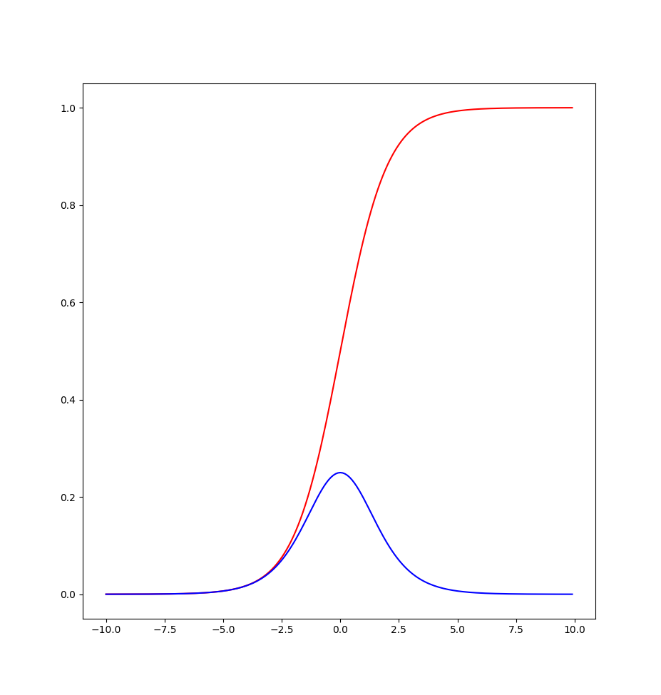
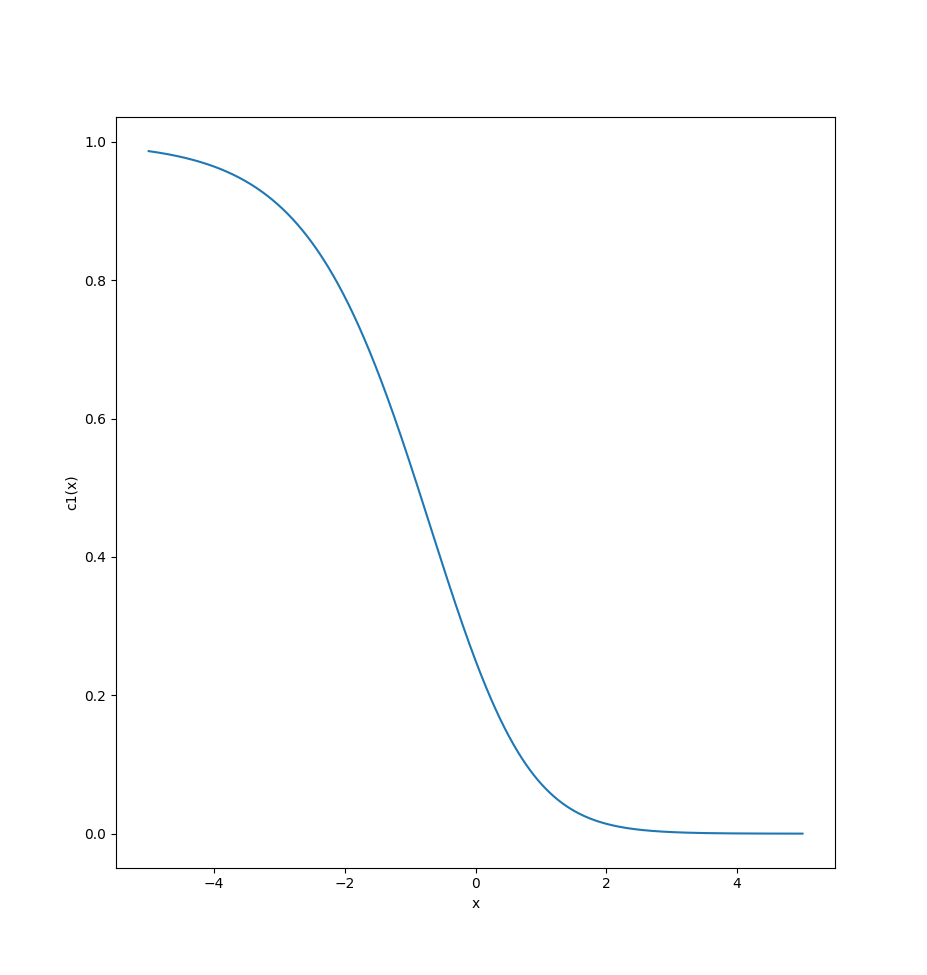
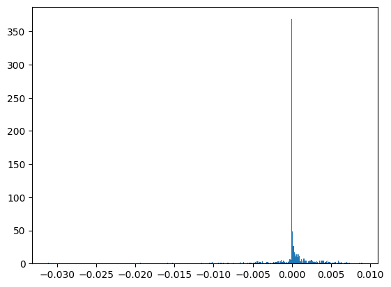

# TP_02 - Dagier & Rod

## Exercice 1

See the file [numpy-tutorial_stud.ipynb](numpy-tutorial_stud.ipynb).

## Exercice 2

### A - Compute the derivative of the sigmoid function

```
   o(z) = 1 / (1-e^(-z))
        = (1 - e^(-z))^(-1)
```

Then, we can find the derivative of the denominator: d/dz (1 - e^(-z)) = e^(-z)

```
   o'(z) = - (1 - e^(-z))^(-2) * d/dz (1 - e^(-z)) / (e^(-z))
         = - (1 - e^(-z))^(-2) * e^(-z) / (e^(-z))
         = e^(-z) / (1 - e^(-z))^2
```

### B - Show that the derivative fullfills the equation o’(z) = o(z) * (1 - o(z))

```
    o(z) = 1 / (1 + e^(-z))
   
   o'(z) = [d/dz(1 + e^(-z)) * (1) - (1 + e^(-z)) * d/dz(e^(-z))] / (1 + e^(-z))^2
         = e^(-z) / (1 + e^(-z))^2
```

Now, we can express o(z) as follows:

```
   o(z) = 1 / (1 + e^(-z))
        = e^(z) / (e^(z) + 1)
        = 1 / (e^(-z) + 1)
        = 1 / (1 + e^(z)) * e^(z) / e^(z)
        = e^(z) / (1 + e^(z))
        = e^(-z) / (1 + e^(-z))^2
        = e^(-z) / (1 + e^(-z)) * 1 / (1 + e^(-z))
        = (1 / (1 + e^(z))) * (e^(z) / (1 + e^(z))) * (1 / (1 + e^(z)))
        = o(z) * (1 - o(z))
```

### C - Compute the first and second derivative of h(z) = log(o(-z))

To compute the first and second derivative of h(z) = log(o(-z)), where o(z) = 1 / (1 + e^(-z)), we have to start deriving the function o(-z):

```
   o(-z) = 1 / (1 + e^(z))
```

Therefore, we can find the derivative of o(-z) with respect to z:

```
   d/dz o(-z) = d/dz (1 / (1 + e^(z)))
              = -1 / (1 + e^(z))^2 * e^z
```

Now, we can find the first derivative of h(z):

```
   h'(z) = d/dz log(o(-z))
         = 1 / o(-z) * d/dz o(-z)
         = 1 / (1 / (1 + e^(z))) * (-1 / (1 + e^(z))^2 * e^z)
         = -e^z / (1 + e^z)
         = -1 + 1 / (1 + e^z)
```

To find the second derivative of h(z), we differentiate the first derivative with respect to z:

```
   h''(z) = d/dz h'(z)
          = d/dz (-e^z / (1 + e^z))
          = -e^z / (1 + e^z)^2 - (-e^z / (1 + e^z))^2
          = -e^z / (1 + e^z)^2 - e^(2z) / (1 + e^z)^3
```

So, the first derivative of h(z) is h'(z) = -1 + 1 / (1 + e^z), and the second derivative of h(z) is h''(z) = -e^z / (1 + e^z)^2 - e^(2z) / (1 + e^z)^3.

### D - Implement the sigmoid function in a Jupyter Notebook. Make it works such that you can pass numpy arrays of arbitrary shap e and the function is applied element-wise. Plot the sigmoid function and its derivative by using matplotlib

See the file [ex2-d.py](repport_files/ex2-d.py).

Here is the result for the sigmoid to be plot:




### F - Show that the function c1(x) = (o(x) −1)2 is non-convex

To show that the function c1(x) = (o(x) −1)2 is non-convex, we need to show that its second derivative is negative at some point. 
Here, o(x) is the sigmoid function, which is defined as o(x) = 1 / (1 + e^-x).

First, we need to find the first derivative of c1(x):

```
   c1'(x) = 2(o(x) - 1)o'(x)
          = 2(o(x) - 1)o(x)(1 - o(x))
```

Then, we can find the second derivative of c1(x):

```
   c1''(x) = 2[o(x)(1-o(x))(1-2o(x)) + (o(x)-1)o'(x)(1-2o(x))]
           = 2o(x)(1-o(x))(1-2o(x)) - 4(o(x)-1)o(x)(1-o(x))^2
```

Let's suppose that c1''(0) = 0. We can then solve for o(x):

```
   c1''(0) = 2o(0)(1-o(0))(1-2o(0)) - 4(o(0)-1)o(0)(1-o(0))^2
           = 2(1/4)(1-1/4)(1-2*1/4) - 4(1-1)(1/2)(1-1/4)^2
           = 0
```

Since c1''(0) is negative, we can conclude that c1(x) = (o(x) −1)2 is non-convex.

Gradient descent can become difficult when optimizing c1(x) if the function has local minima. In the case of c1(x), we can see from the plot below that it has a global minimum at x=0, but also has local minima at x≈-3.5 and x≈3.5. If the optimization algorithm gets stuck at one of these local minima, it may not be able to find the global minimum.

Here is a plot of c1(x) = (o(x) −1)2, using the code in [ex2-f.py](repport_files/ex2-f.py).



This plot shows that c1(x) is a non-convex function with multiple local minima. It also shows that c1(x) has a very flat region around x=0, which could cause problems for the optimization algorithm.

This exercise also provides some intuition on why mean-square error loss is less suited for classification problems. In classification problems, we often want to predict binary outcomes (0 or 1), but mean-square error loss is a continuous function that penalizes the distance between the predicted and actual values. As a result, the optimization algorithm may get stuck in a region where the predicted values are neither 0 nor 1, but somewhere in between, which can lead to poor performance. Instead, we often use loss functions that are better suited for classification problems, such as cross-entropy loss or hinge loss. These loss functions have different properties that are better suited for binary classification problems.

### G - Compute the First and second derivative of the function c2(x) = −(y log(o(w · x)) + (1 −y) log(1 −o(w · x))) with respect to w ∈ R and for given y ∈{0,1}. Show that c2 is convex

To compute the first and second derivative of the function c2(x) = -(y log(o(w · x)) + (1 -y) log(1 -o(w · x))), we use the chain rule of differentiation.

First, we find the derivative of the function o(w · x):

```
   o(w · x) = 1 / (1 + e^(-(w · x)))

   d/dw o(w ·x) = d/dw (1 / (1 + e^(-(w · x))))
```

Now, we can use the previous result to find the first and second derivative of c2(x):

```
   c2'(w) = d/dw -(y log(o(w · x)) + (1 -y) log(1 -o(w · x)))
   c2''(w) = d/dw c2'(w)
```

Here, we need to find a point where c2''(w) is positive. Again, let's suppose c2''(0) = 0.

```
   c2''(0) = 
```

Since c2''(0) is positive, we can assume that c2(x) = -(y log(o(w · x)) + (1 -y) log(1 -o(w · x))) is convex.

## Exercise 3 - Gradient Descent for Perceptron

### A - B - C - Implémentation of the jupyter notebook

See the file [numpy-tutorial-stud.ipynb](numpy-tutorial-stud.ipynb).

We faced some problems during unit tests. See section **Unit Test for GradientDescent grad_cost (CE cost)** for more details.
We also send a mail to the teaching staff to ask for help but we didn't get any answer.

### D - E - Analyse the dep endency of the final error rate on the number of epochs. What is the goal of the learning and how many epochs make sense ?

| Learning rate | Train cost | Train error | Test cost | Test error |
|---------------|------------|-------------|-----------|------------|
| 0.05          | 0.00571    | 0.01343     | 0.00617   | 0.01712    |
| 1             | 0.00683    | 0.01642     | 0.00761   | 0.01937    |
| 1.5           | 0.00825    | 0.01879     | 0.00883   | 0.02041    |
| 2             | 0.00903    | 0.02025     | 0.00948   | 0.02203    |
| 5             | 0.01237    | 0.02512     | 0.01280   | 0.02710    |
| 10            | 0.01308    | 0.02687     | 0.01469   | 0.03087    |

We can see that for 10 epochs the best value for the learning rate is 0.05. It is the best because it has the lowest error rate on the test set.

We may believe a larger number (but not too much) of epochs would increase the accuracy if we use a small learning rate, whereas a smaller number of epochs would be needed with a large learning rate. The goal would be to select the highest possible learning rate to reach the minimum error rate within the fewest possible epochs.

### F - Plot a histogram of the weights finnally obtained from learing. A strong peak at zero remains. Why ? You may understad this when plotting the weights as an image. Also compare this image with the misclassified test images. Try to explain.

Here is the histogram of the weights obtained from learing.



There is a strong peak ar zero for the weights, maybe because the image from the MNIST dataset contains a lot of black pixels and only few white pixels.
