# Practical Work 04 - 14.03.2023 - Universal Representation Theorem Model Selection

Realized by: Thomas Dagier and Quentin Rod

## Exercise 1 - Function Approximation

### A - Compute the formulas for gradient descent for this problem

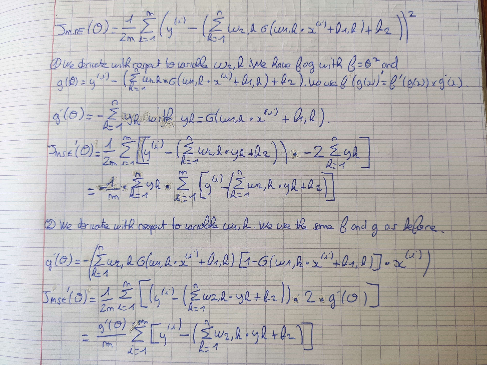

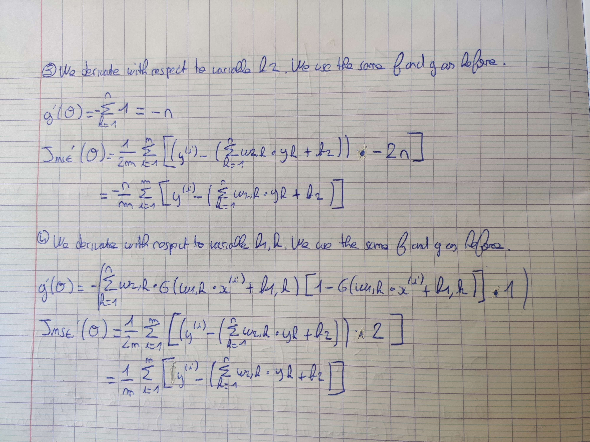

### B - Implement MBGB for this model in the notebook

See **function_approximation_stud.ipynb**. While we were implementing the equations we found in the previous exercise, we noticed that the equations were not 100% correct. We made few changes inside the notebook with a note.

### C - Study the impact of different setting by looking at the learning curves

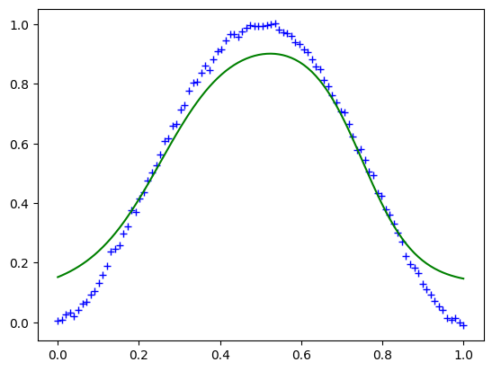

Alpha = 0.1

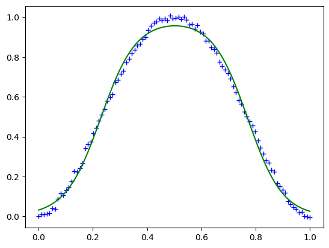

Alpha = 0.2

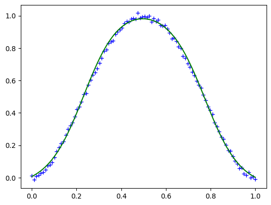

Batch = 5

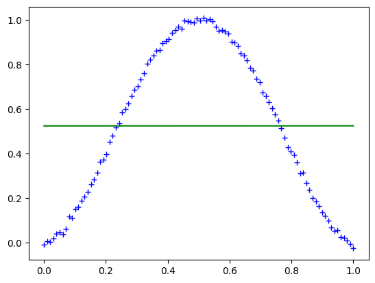

Batch = 50

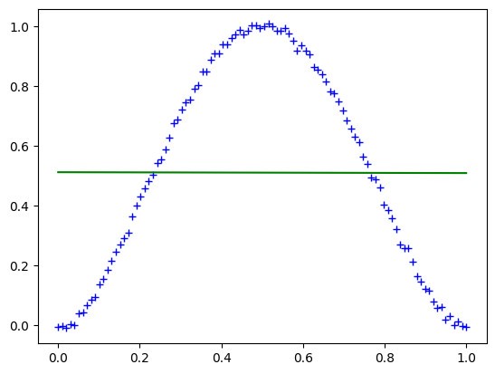

Epochs = 10

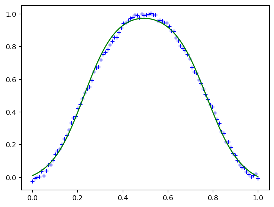

Epochs = 1000

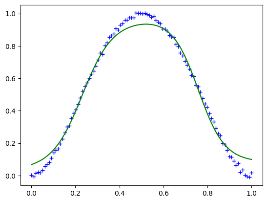

Neurons = 5

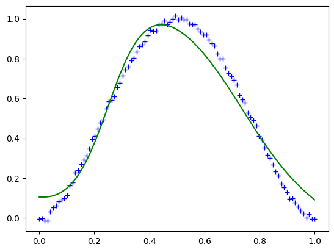

Neurons = 50

A good balance would be alpha=0.2, batch size = 20, neurons = 50 and epochs = 1'000

## Exercice 2

### A - Complete the code

See **overfitting_stud.ipynb**.

### B - Construct different models of differenet coplexities (parameter order)

Version 1 (score_train_1.csv):

| order | error rate (train) | error rate (test) |
|-------|--------------------|-------------------|
|   1   |        0.05        |        0.14       |
|   2   |        0.06        |        0.16       |
|   3   |        0.04        |        0.12       |
|   4   |        0.05        |        0.11       |
|   5   |        0.04        |        0.11       |
|   6   |        0.04        |        0.10       |
|   7   |        0.04        |        0.11       |

Version 2 (score_train_2.csv):

| order | error rate (train) | error rate (test) |
|-------|--------------------|-------------------|
|   1   |        0.10        |        0.11       |
|   2   |        0.03        |        0.05       |
|   3   |        0.01        |        0.06       |
|   4   |        0.02        |        0.08       |
|   5   |        0.00        |        0.05       |
|   6   |        0.00        |        0.04       |
|   7   |        0.00        |        0.04       |

### C - Determine the model best suited for the problem at hand

Version 1 (score_train_1.csv):

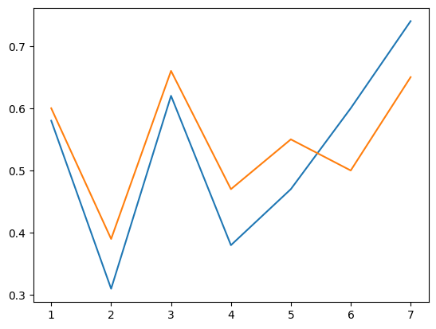

Version 2 (score_train_2.csv):

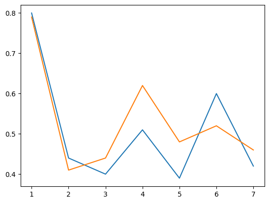

The best model would be the model where the test error is minimized for both version. In our case, it seems like the order 7 with 4'000 epochs is the best model.
