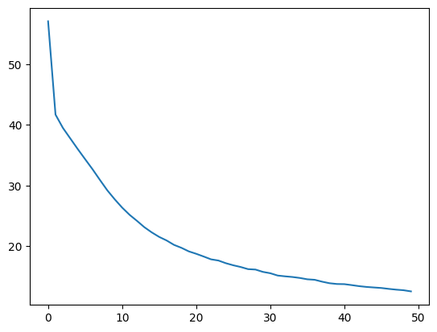

# TP_07 - Dagier & Rod

## Exercise 1 - Computational graph exercise

## Exercise 2 - TensorFlow 2.0 installation

x

## Exercise 3 - MLP with TensorFlow 2.0

Here are the results for Exercise 3 after 50 epochs, for a learning rate alpha=0.01, for a batch_size=128 and 300 neurons

samples  :  10000
correct  :  8789
missed   :  1211
accuracy   :  87.89 %
error rate :  12.11 %

## Exercise 4 - MLP with TensorFlow 2.0 and Keras

Here are the results for Exercise 4 with the sames metrics in input:

Test loss: 0.015877963975071907
Test accuracy: 0.9211999773979187

As we could expect, Keras is way better for this kind of problem as shown by the loss.