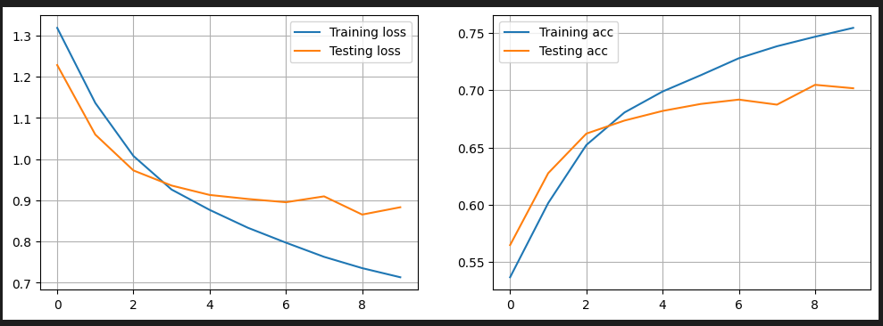
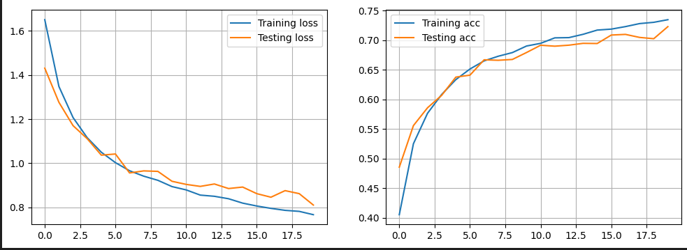
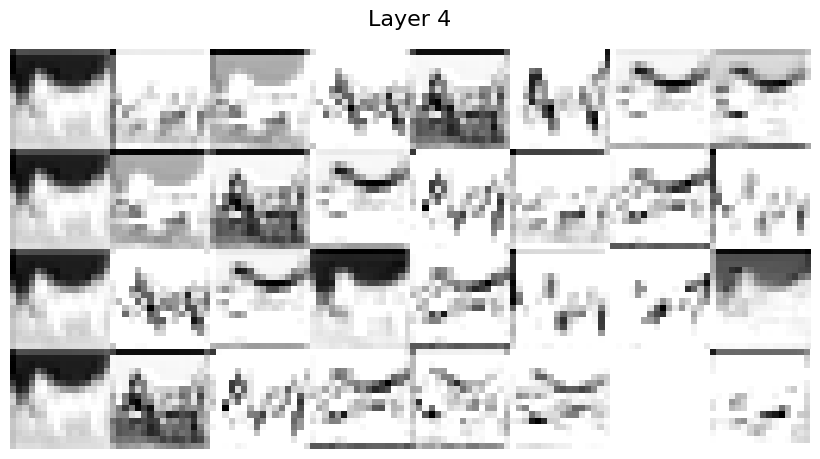

# TP_10 - Dagier & Rod

## Exercise 1 - Data Augmentation

Here is the inital values without data augmentation using 10 epochs and a batch of 128 images:

And here are the loss and accuracy for both training and testing using 20 epochs, a batch of 128 images and data augmentation:

As we could expect from the course's slides, we observe an improvement as shown by the curves in the second plot. 

Particularly for the testing loss, using data augmentation make the loss decrease from 0.9 to 0.8.

Here are  more example with several architectures :

| CNN | Architecture description | Acc. train | Acc. test |
|-----|--------------------------|------------|-----------|
|  No DA v1 (1)| CONV(32F,same)-RELU-CONV(32F,same)-RELU-MAXP(2)-CONV(32F,same)-RELU-MAXP(2)-DENSE | 0.76  | 0.70 |
|  With DA v1 (2) | CONV(32F,same)-RELU-CONV(32F,same)-RELU-MAXP(2)-CONV(32F,same)-RELU-MAXP(2)-DENSE | 0.7348  | 0.7231 |
|  With DA v2 (3) | CONV(32F,same)-RELU-CONV(32F,same)-RELU-MAXP(2)-CONV(32F,same)-RELU-MAXP(2)-DENSE | 0.8001  | 0.7433 |
| With DA v2 (4) | CONV(32F,same)-RELU-MAXP(2)-CONV(32F,same)-RELU-MAXP(2)-DENSE | 0.8032  | 0.7554 |
| With DA v2 (5) | CONV(32F,same)-RELU-CONV(32F,same)-RELU-DENSE | 0.7904  | 0.7284 |
| With DA v2 (6) | CONV(32F,same)-RELU-MAXP(2)-CONV(32F,same)-RELU-MAXP(2)-CONV(32F,same)-RELU-MAXP(2)-DENSE | 0.8153  | 0.7563 |

After several testing it seems like using 20 epochs with the third model, a "categorical_crossentropy" for the loss and "adam" as optimizer is the best strategies for combining a small loss and a good accuracy using data augmentation and a batch of 128 images.

TESTER D'AUTRES RESEAUX (voir table of results)

## Exercise 2 - Visualisation of Activations

Here is the output of our different activation maps using our best network (see ex. 1) at layer 4.

We kept X_train[12] as input image and we can see that ...