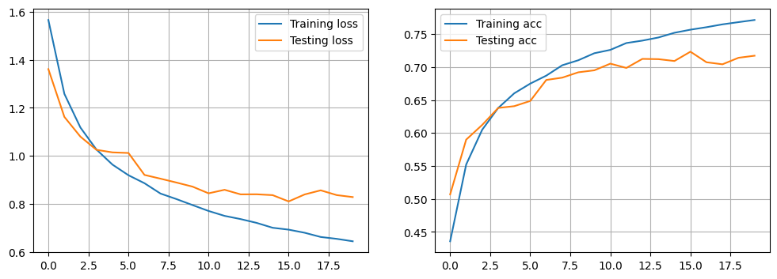

# TP_11 - Dagier & Rod

## Exercise 1 - Function API of Keras

Here is the best model architecture we used last week and the results we have (sequential):
**CONV(32F,same)-RELU-MAXP(2)-CONV(32F,same)-RELU-MAXP(2)-DENSE**

And here is an example of the same architecture using the functional API of Keras:

As we could expect from the course's slides, the performance is quite similare as both model have the same number of parameters. 

Here are  more example with several architectures :

"Copier le tableau"

And their curves:

For all the tests we have done, we made 20 using a "categorical_crossentropy" for the loss and "adam" as optimizer.

## Exercise 2 - Transfer Learning

We tested ResNet50V2 but didn't have good results. So we used MobileNetV2.

We removed the top layer in order to do our predictions and added some layers.
The architecture can be seen in img1.png.

We firstly train the model with MobileNetV2 layer frozen. We used 5 epochs, a batch size of 128 and learning rate of 10^-3.
At the end of the training, training accuracy is 0.57 and validation accuracy 0.67. Loss evolution can be seen on img2.png

Then we unfroze the MobileNetV2 layer and trained another time. With learning rate of 10^-5. We used 1 epochs and 128 as batch size.
Unfortunately, Python kernel crashed during training.

